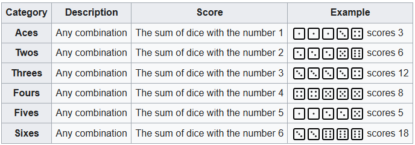
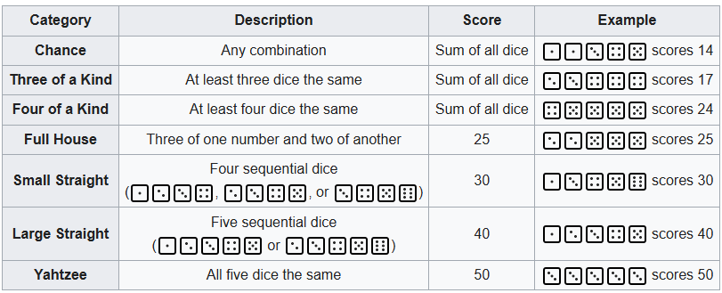
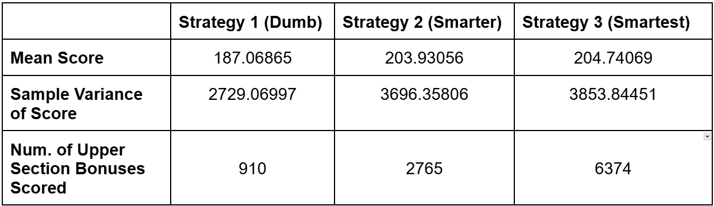
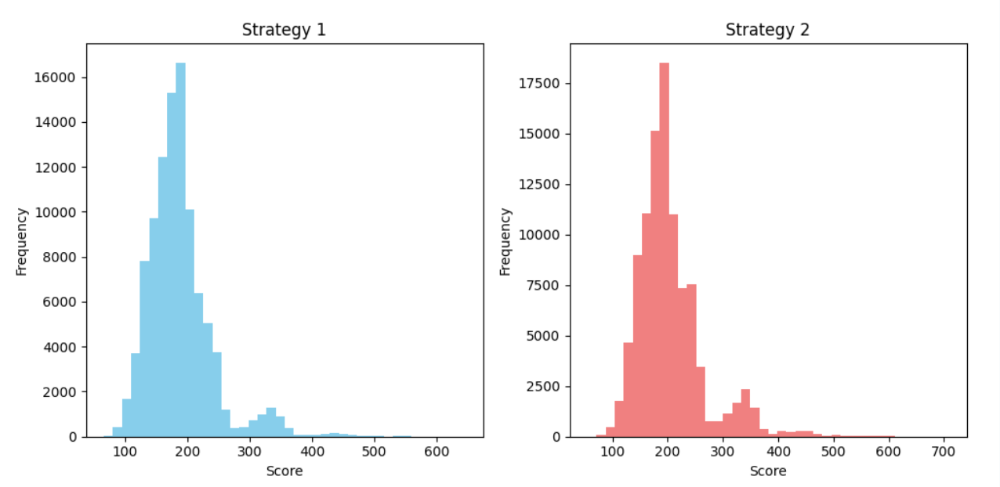
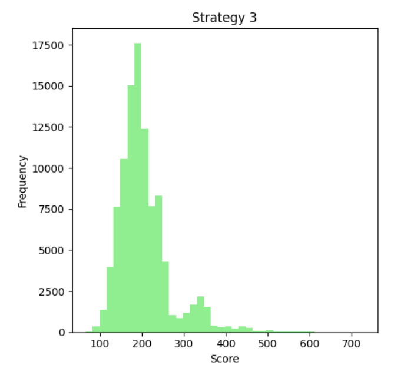

Growing up, we were a Yahtzee family. I have fond memories of fervently shaking the dice in a plastic cup, hoping for that elusive Yahtzee. Entirely too often, that Yahtzee never came, and I would end up losing yet again to my sister. So now that I'm a grown adult, I thought I would finally figure out what I did wrong as a kid, and use Monte Carlo simulation to find the best strategy.

## A Full Description Of The Rules Of Yahtzee

What follows is a refresher of the rules of Yahtzee, mostly cribbed from Wikipedia. Feel free to skip ahead if you're already familiar, or if you just want to get to the fun stuff.

The game consists of thirteen turns, and the objective is to achieve the highest possible score. Each turn, the player rolls 5 dice. Then, they can choose which of the five dice to *hold*, rolling the remaining dice again. They repeat this process once more, rolling a total of three times per turn. Then, the player must choose one of the thirteen possible categories to score their dice. These are divided into an upper section and a lower section on the scoresheet. 

The upper section contains these six categories:

 
If a player achieves a score of at least 63 in the upper section, they receive an additional 35 point bonus.  

The lower section contains these categories:

A player may choose a category even if their dice do not fulfill the requirements of that category and receive a score of zero. Once a player uses a category, they fill in the score box for that category and cannot use that category again in this game. However, if a player has already filled their Yahtzee box with a score of 50, if they later get another Yahtzee, then they get a Yahtzee bonus of 100 points, and then pick a separate category to fill in, as usual. If the upper section category for the Yahtzee roll has not been filled in, then that category must be chosen. 

Additionally, a Yahtzee can be used as a *Joker* for the Full House, Large Straight, and Small Straight categories, if the Yahtzee box and the corresponding upper section box for the roll have already been filled in. For example, if a player rolls 5 threes, and they have already chosen the Yahtzee box earlier in the game, then they must choose the Threes category. If the Threes category has already been filled in, then they can choose any lower section category - they might choose, for example, the Large Straight category (using the Yahtzee roll as a Joker) and receive 40 points.

If any of that was confusing, don't worry - I was halfway into coding this when I realized I had been implementing the Jokers incorrectly and had to backtrack. If you'd prefer a man patiently explain the rules over slo-mo shots of rolling dice, [this](https://www.youtube.com/watch?v=5Zzttnc4C8w) might be more to your taste.

## Implementing Yahtzee In Python

Our first task is to take the rules as written above, and translate them into code. Like many games, Yahtzee consists of small, repeating loops that are used as building blocks for the complete game. For this game, the smallest building block is the dice roll. Three rolls form a turn, and thirteen turns form a game. So at a high level, all we have to do is recreate the dice rolls, package them together to form a turn, then package the turns together until we have a full game. For now, we won't worry about the strategy - we'll just focus on the structure of the game itself.

The initial roll is easy: just pick five random integers between 1 and 6. For each subsequent roll, we have to decide which dice to hold, and re-roll the remaining dice, picking a new random integer for each. Repeat this process for a total of three rolls, and we have our final roll. 

Next, we have to decide which category to pick. We have thirteen possible categories, and we'll pick one each turn. Whichever we choose, we then have to score our roll based on that category. So we'll create a function that can take any roll and score it based on the chosen category. Now, we mark that category off our list, add the score to our total, and begin our next turn. Rinse and repeat until we've chosen every category.

I've elided some details, like the Yahtzee bonus and Joker stuff; but that's the basic structure. Now we get to the fun stuff - the strategy.

## Three Strategies for Playing Yahtzee

A Yahtzee player can control just two aspects of the game: which dice to hold, and which category to choose. So all strategy must boil down to optimizing those two things. Below, we'll explore three strategies that a player might use in Yahtzee, and compare them.

### Strategy 1: Dumb Yahtzee

First, we need a baseline. How might a beginner (or perhaps a young me with a still-developing pre-frontal cortex) play the game? We can observe that there are generally two **types** of scoring categories: straights, and X of a kind. Each type of category has a different tactic for holding dice - hold runs for straights, and repeated dice for X of a kind. Furthermore, we can observe that if we get a good initial roll for X of a Kind, it usually doesn't make sense to try to switch to straight, and vice versa. So given this, we should probably first check what type of roll we have, then choose our strategy from there. With this in mind, we can describe a simple algorithm for Dumb Yahtzee as follws:

1. Initial roll.

2. If we haven’t played the Large Straight yet, check if we rolled a Large Straight. If we have, hold all dice.

3. If we haven’t played the Small Straight yet, check if we rolled a Small Straight. If we have, hold the dice that form the Small Straight.

4. If we don’t have a straight, or we have already played the straight categories, then count the dice, and hold any dice values that appear at least twice.

5. Roll all dice that have not been held, and return to step 2. We get three rolls in total, so this step must be performed twice.

6. Now, we have our final roll result. We must choose which category to fill in. For each category still to be played, check what our score would be if we played that category.

7. Then, choose the category for which our score would be the highest. If there are more than one category that would yield the same highest score, then choose one of 
those categories at random.

8. Remove the chosen category from our available categories and add the score to our total.

9. Begin our next turn, returning to step 1 and repeating until every category has been chosen.

### Strategy 2: Smarter Yahtzee

Dumb Yahtzee is okay. We could use it to get through any friendly game of Yahtzee and not get laughed out of the room. But there are a few obvious mistakes that this algorithm makes. Let's see if we can fix those errors. We can start with the basic algorithm above, and improve it to Smarter Yahtzee with two simple changes:

1. If there are multiple options for the highest scoring category, we should always choose the most difficult or rarest category, to minimize the chance that we later have to take a zero for that category. For example, if we roll four of a kind, then the categories Four of a Kind, Three of a Kind, and Chance will all yield the same score. Strategy 1 will choose one of these three at random, but we should always choose Four of a Kind in this case.

2. Always holding any dice that appear at least twice only makes sense if Full House is still an available category. Otherwise, even if multiple values of dice appear twice, we should only keep one value. Furthermore, since many of the categories are scored based on the value of the dice, we should keep the higher value dice. For example, if we initially roll **[5 5 4 4 2]**, and we have played the Full House category earlier in the game, then we should only keep **[5 5]** and re-roll the rest.

### Strategy 3: Smartest Yahtzee?

Smarter Yahtzee is a clear and obvious improvement over Dumb Yahtzee. But can we make it better? The low-hanging fruit might be picked, but there still may be improvements to be made. Let's make just one small tweak to Smarter Yahtzee, and see if it improves our score.

Recall that the player receives a bonus of 35 points if the upper section score is at least 63 at the end of the game. What if we attempt to increase the chance of receiving this bonus, even at the cost of lowering our score elsewhere? Let's automatically choose the upper section category for four of a kind rolls[^1] with sixes, fives, or fours, assuming that the upper section category has not yet been played. Before we run the simulation, it's unclear whether this is actually an improvement over Smarter Yahtzee. While this does increase the chance of an upper section bonus, it is easy to see that it will also lower the average score from the Four of a Kind category (which are now more likely to score with ones, twos, or threes, if at all). Let's see how it actually performs.

## Running The Monte Carlo Simulation

The strategies outlined above are implemented as a Python script, which will automatically play the complete game and record the resulting score. Each strategy is run 100,000 times, and the mean and the variance of the scores of each strategy is captured. Let's see how they did. 

It's clear, as predicted, that Strategy 2 and Strategy 3 are a large improvement over Strategy 1. The number of upper section bonuses is also included in the table, and it is evident that Strategy 3 does result in an increase in upper section bonuses. More concretely, Strategy 3 resulted in 6.374% of the runs scoring the additional bonus(which is lower than I expected - maybe there's a way to improve this even more?), compared to 2.765% in Strategy 2. We might think that the score for Strategy 3 should increase by an expected (35 points * (0.06374 - 0.02765)) = 1.26 points over Strategy 2; but this is really an upper bound for the increase in score, as optimizing for a higher score in the upper section should lower the score in lower section categories, as mentioned before. 

In fact, we can see that Strategy 3 results in a mean score that is 0.81013 higher than Strategy 2! Since the true distribution of scores is unknown (we can observe from the histograms below that scores are non-normal; they have a long, heavy right-tail and a light left tail), we can use a non-parametric test to determine if this result is statistically significant. If we use the Mann-Whitney U test for independent samples to compare the scores from Strategy 2 and Strategy 3 with a standard alpha value of 0.05, Strategy 3 results in a higher score with a p-value of 0.036. Since this is below the chosen alpha value, we can conclude that Strategy 3 results in a small but statistically significant improvement in score. So yes, Strategy 3 turns out to be the smartest Yahtzee strategy.

If you want to try this out for yourself, or have a deeper look, all of the code is available at my [github page](https://github.com/shaunish/yahtzee). And next family gathering, I'm going to suggest we play Yahtzee - and get my revenge.

[^1]: Why just four of a kind rolls for fours, fives, and sixes? Well, five of a kind are Yahtzee rolls - we don't want to mess with those. If it's our first Yahtzee, then we want to just use the Yahtzee category for our 50 points. For subsequent Yahtzee rolls, the rules require the corresponding upper section category be chosen anyway. 

Note that 63 is the score in the upper section that results from three of a kind for each upper section category. So if we can get a four of a kind for some of the higher value categories, which are the biggest contributors to the score, then we should be able to get the bonus more often. Plausibly, forcing higher value three of a kind to the upper section might be a net positive to score as well - that might be a later experiment.
